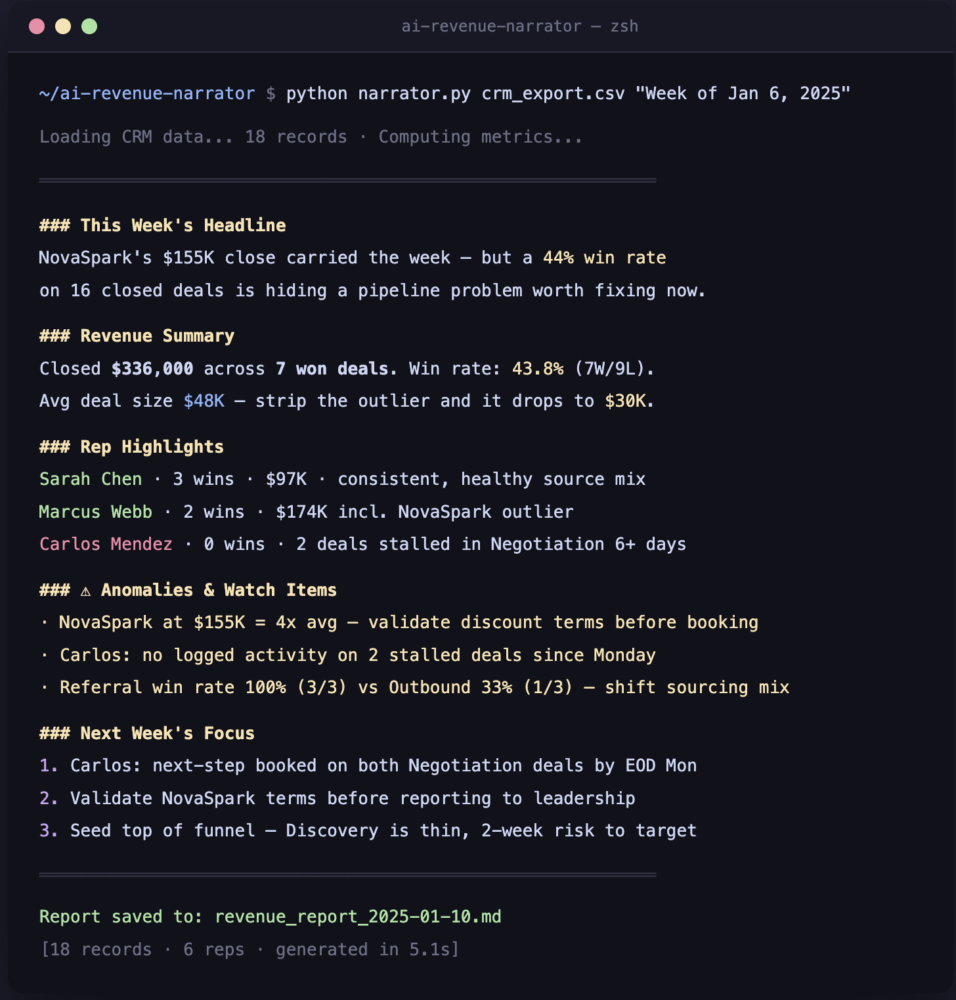

# AI Revenue Report Narrator

> AI agent that reads your CRM pipeline data, detects anomalies, and writes your weekly revenue narrative automatically.

Built for RevOps and Marketing leaders who spend Monday mornings copy-pasting numbers into a report nobody finishes reading.

---

## How It Works

1. Export your deals as a CSV from HubSpot, Salesforce, or Pipedrive
2. The agent computes deal metrics: closed revenue, win rate, pipeline by stage and rep
3. Anomaly detection flags outlier deals, win rate drops, and stalling stages
4. Claude writes a plain-English narrative formatted for a CRO or VP of Sales
5. Report streams live and saves as a dated `.md` file

---

## Demo



```bash
$ python narrator.py sample_crm_data.csv "Week of Jan 6, 2025"

Loading CRM data... 18 records · Computing metrics...

════════════════════════════════════════════════════════════

### This Week's Headline
NovaSpark's $155K close carried the week — but a 44% win rate
on 16 closed deals is hiding a pipeline problem worth fixing now.

### Revenue Summary
Closed $336,000 across 7 won deals. Win rate: 43.8% (7W/9L).
Avg deal size $48K — strip the outlier and it drops to $30K.

### ⚠ Anomalies & Watch Items
· NovaSpark at $155K = 4x avg — validate discount terms before booking
· Carlos: no logged activity on 2 stalled Negotiation deals since Monday
· Referral win rate 100% (3/3) vs Outbound 33% (1/3) — shift sourcing mix

### Next Week's Focus
1. Carlos: next-step booked on both stalled deals by EOD Mon
2. Validate NovaSpark terms before reporting to leadership
3. Seed top of funnel — Discovery is thin, 2-week risk to target

════════════════════════════════════════════════════════════

Report saved to: revenue_report_2025-01-10.md  [18 records · 5.1s]
```

---

## Try the demo (no API key needed)

```bash
python demo.py
```

---

## Setup

```bash
pip install -r requirements.txt
```

Copy `.env.example` to `.env` and add your API key:

```bash
cp .env.example .env
# then edit .env and set ANTHROPIC_API_KEY=sk-ant-...
```

---

## Usage

```bash
# Auto-detects current week
python narrator.py hubspot_export.csv

# Specify a period label
python narrator.py crm_data.csv "Week of May 5, 2026"
```

---

## How to Export Your CRM Data

### HubSpot
1. Go to **CRM → Deals**
2. Click **Actions → Export**
3. Select **CSV**, choose date range → Export
4. Download and run: `python narrator.py deals_export.csv`

### Salesforce
1. Go to **Reports → Opportunities**
2. Run the report → click **Export** → **Formatted Report → CSV**
3. Download and run: `python narrator.py opportunities.csv`

### CSV Column Mapping

The script auto-detects common column names from both platforms:

| Field | Accepted column names |
|-------|-----------------------|
| Deal value | `amount`, `deal_value`, `value` |
| Stage | `stage`, `status` |
| Owner/Rep | `owner`, `rep`, `assigned_to` |
| Lead source | `lead_source`, `source` |
| Company | `company`, `account` |

Any extra columns pass through and are ignored.

---

## Automate with Cron

Run the narrator every Monday at 8am automatically:

```bash
# Open crontab
crontab -e

# Add this line (update path to match your setup)
0 8 * * 1 cd /path/to/ai-revenue-narrator && python narrator.py latest_export.csv >> reports.log 2>&1
```

Pipe output to email or Slack with a simple wrapper script for full hands-free reporting.

---

## Report Sections

| Section | What it covers |
|---------|---------------|
| This Week's Headline | Single most important thing that happened |
| Revenue Summary | Closed revenue, win rate, deal volume |
| Pipeline Health | What's moving, what's stalling, where the risk is |
| Rep Highlights | Who's carrying the number, who needs attention |
| Anomalies & Watch Items | Outliers, drops, stalls flagged automatically |
| Next Week's Focus | 2–3 specific actions to prioritize |

---

## Stack

- Python 3.10+
- [Anthropic Claude API](https://docs.anthropic.com) (`claude-sonnet-4-6`) with streaming
- Zero heavy dependencies — no pandas, no BI tools required

---

## Why This Matters

RevOps teams spend 3–5 hours per week writing revenue narratives that rehash numbers everyone can see in a dashboard. This agent writes the *so what* — the analysis layer — in under a minute. For a team doing this weekly, that's 150+ hours a year returned to actual strategy work.

---

Built by [Henry Tran](https://linkedin.com/in/gethenry) | [RevOps Marketing](https://revopsmarketing.net)
Part of an open-source suite of AI agents for revenue teams.
